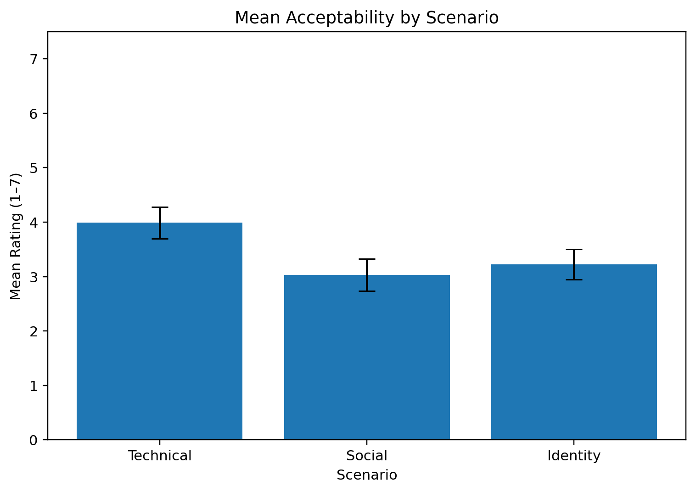
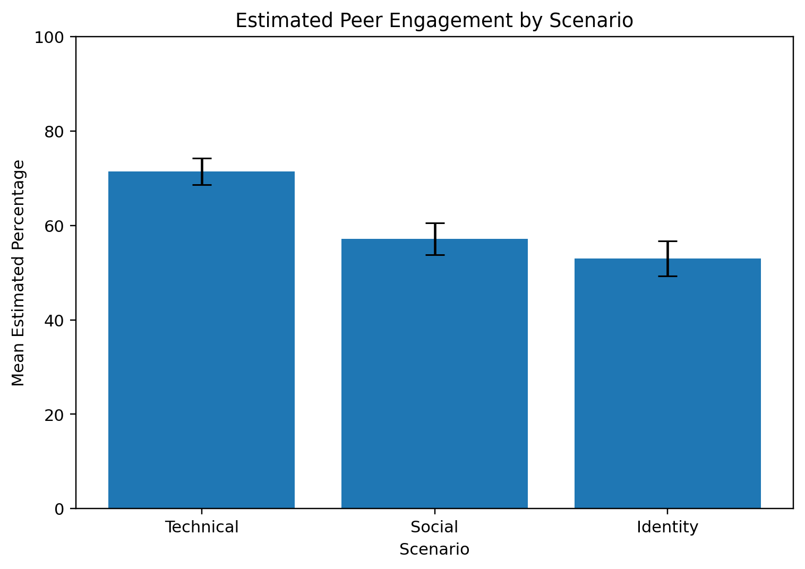
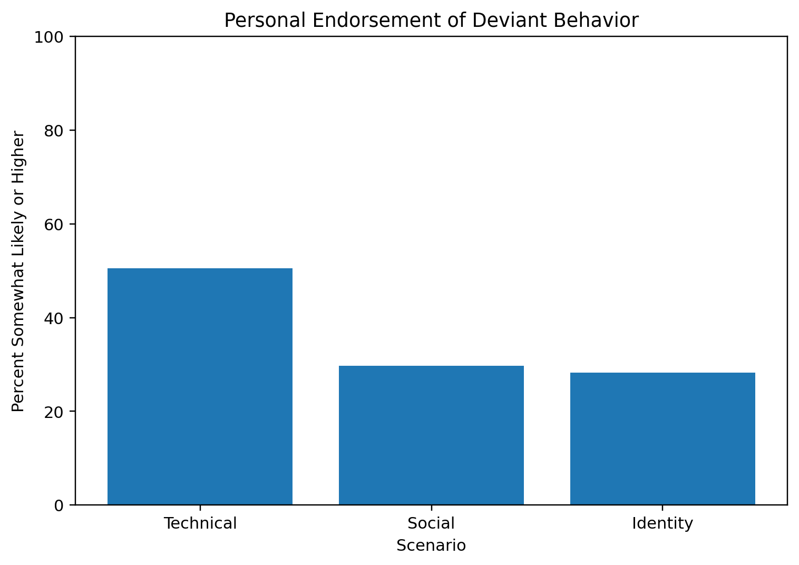
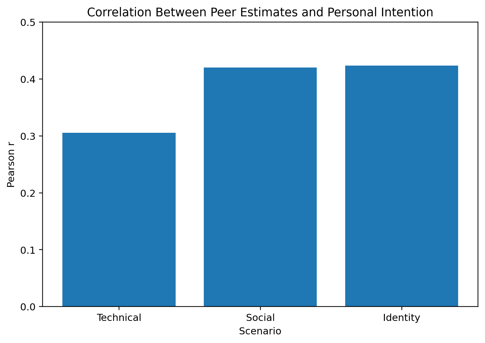
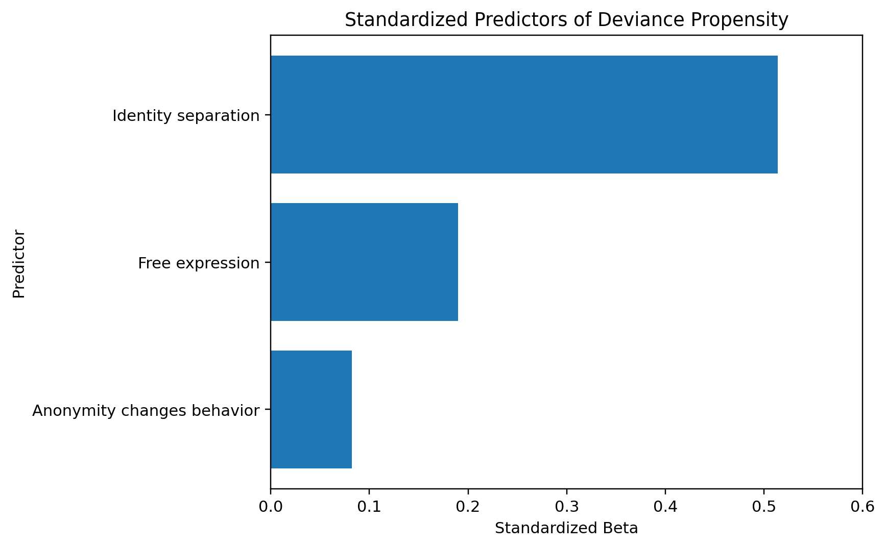
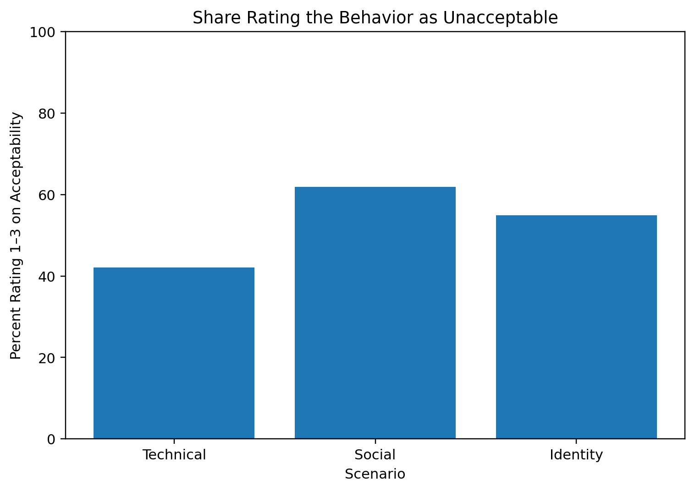

# Survey Results and Statistical Summary

This page provides the survey materials, descriptive results, and statistical findings used in the study on online deviance propensity. The goal is transparency: a reader reviewing the survey outputs should be able to see the same empirical patterns reported in the manuscript and understand how those patterns support the study’s conclusions.

## Survey Materials

The survey summary report is available here: [Survey Summary PDF](Data_All_260421.pdf)

The raw export used for analysis is available here: [Raw Survey Data ZIP](Data_All_260421%20%281%29.zip)

A compact summary table of the main descriptive values used in the charts is available here: [Visual Summary CSV](visual_summary.csv)

## How the data were analyzed

All three deviance scenarios were evaluated by the same respondents. Because those scenario comparisons were repeated measures, omnibus comparisons across the three scenarios were tested using **Friedman’s test**, followed by **Wilcoxon signed-rank tests** for pairwise follow-up comparisons. Within-scenario differences between moral acceptability and personal behavioral intention were tested using paired-samples *t* tests. Associations between estimated peer behavior and personal behavioral intention were assessed using Pearson correlations, and deviance propensity was modeled using multiple regression.

## Key descriptive patterns

The results show a consistent hierarchy across the three scenarios. Technical deviance was rated as more acceptable, was seen as more common among average users, and received substantially greater personal endorsement than either social deviance or identity deviance. Social and identity deviance were both judged more negatively and were endorsed at much lower rates.

## Key inferential findings

Cross-scenario differences in acceptability were statistically significant, Friedman χ²(2) = 30.72, *p* < .001. Pairwise Wilcoxon tests showed that technical deviance was rated as significantly more acceptable than both social deviance (*W* = 2062.5, *p* < .001) and identity deviance (*W* = 2308.0, *p* < .001). Social and identity deviance did not differ significantly (*W* = 2308.0, *p* = .064).

Cross-scenario differences in behavioral intention were also statistically significant, Friedman χ²(2) = 38.00, *p* < .001. Technical deviance received significantly higher behavioral-intention ratings than both social deviance (*W* = 2381.5, *p* < .001) and identity deviance (*W* = 2349.5, *p* < .001). Social and identity deviance did not differ significantly (*W* = 2468.5, *p* = .982).

Within the technical deviance scenario, personal behavioral intention significantly exceeded moral acceptability, *t*(201) = 2.83, *p* = .005. Equivalent acceptability–intention gaps were not statistically significant for social deviance, *t*(201) = 1.00, *p* = .320, or identity deviance, *t*(201) = -0.43, *p* = .667.

Across all three scenarios, higher estimates of peer deviance were associated with greater personal willingness to engage in the same behavior. The scenario-level Pearson correlations were .306 for technical deviance, .420 for social deviance, and .423 for identity deviance, all *p* < .001. The average projective norm estimate was also positively associated with total deviance propensity, *r* = .382, *p* < .001.

In the regression model predicting total deviance propensity, anonymity attitudes explained 43.8% of the variance, *R*² = .438, adjusted *R*² = .429, *F*(3, 186) = 48.23, *p* < .001, with *n* = 190 complete cases. The strongest predictor was the belief that online and offline identities are separate, β = .514, *p* < .001. Free expression under anonymity was also significant, β = .190, *p* = .009. The general belief that anonymity changes behavior was not a significant predictor, β = .082, *p* = .140.

## What conclusions these data support

These survey results support four main conclusions.

First, technical deviance was treated differently from the two more interpersonal forms of deviance. It was judged as more acceptable, more common, and more behaviorally endorsable.

Second, respondents who estimated higher levels of peer deviance were more likely to say they would engage in the same behavior themselves. This pattern supports the projective vignette approach used in the study.

Third, the strongest anonymity-related predictor of deviance propensity was not general awareness that anonymity affects behavior, but the more personal belief that one’s online and offline identities are psychologically separate.

Fourth, the pattern of results supports the conclusion that interventions should be calibrated to the type of deviance involved rather than applied uniformly across all forms of online misconduct.

## Visual summaries

## Mean acceptability by scenario

## Estimated peer engagement by scenario

## Personal endorsement of deviant behavior

## Correlation between peer estimates and personal intention

## Standardized predictors of deviance propensity

## Share rating the behavior as unacceptable

## Notes on transparency

The charts on this page present descriptive summaries of the survey results. The statistical conclusions above are based on the same dataset and correspond to the analyses reported in the manuscript. The overall survey sample size was **N = 202**. Analyses involving the anonymity-attitude items used fewer complete cases because of item-level missingness, which reduced the regression sample to **n = 190**.
